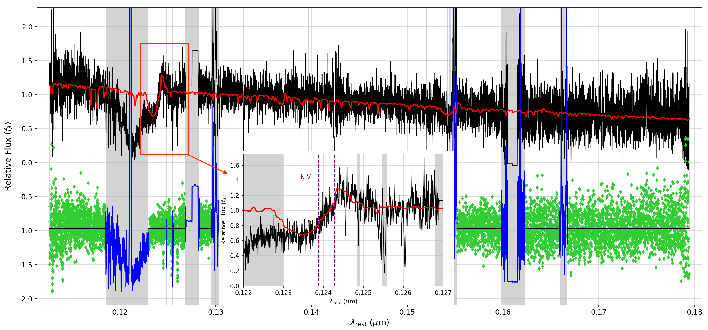
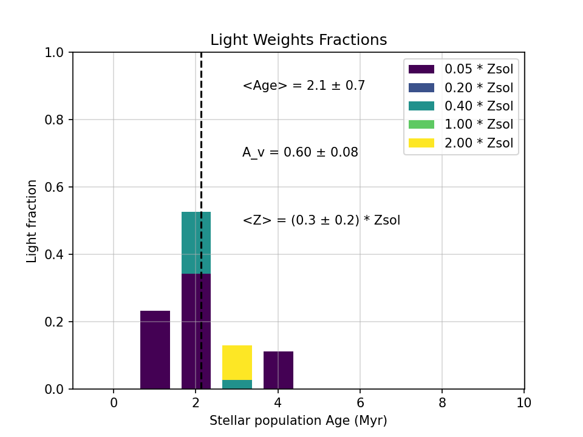

# Summary
`GalSpecFitX` is an open-source Python package for the full-spectrum fitting of galaxy spectra using the widely adopted Penalized Pixel-Fitting method (pPXF; [@Cappellari2004; @Cappellari2017]). The software automates the common preprocessing steps required for reliable fitting—including Galactic extinction correction, redshift correction, binning, normalization, and masking—and provides an interface for stellar population synthesis models such as `Starburst99` [@Leitherer1999; @Leitherer2014] and `BPASS` [@Eldridge2017].

By combining a reproducible configuration system with modular design, GalSpecFitX lowers the barrier to entry for researchers new to spectral fitting, while providing flexibility for advanced users. The package enables astronomers to derive key physical properties of galaxies—such as stellar ages, metallicities, dust attenuation, and star formation histories—without requiring extensive expertise in data preparation or model handling.

While originally motivated by ultraviolet spectroscopic data from the Hubble Space Telescope, the software is broadly applicable to optical and UV galaxy spectra obtained with a variety of telescopes and instruments. Although GalSpecFitX provides native support for Starburst99 and BPASS in the UV–optical range, its modular framework enables seamless integration of other stellar population models.

# Statement of need
Full-spectrum fitting is a cornerstone of extragalactic astronomy. By comparing observed galaxy spectra with synthetic stellar population models, researchers can extract information about stellar content, kinematics, and chemical enrichment. Among available approaches, the pPXF algorithm has become a standard due to its robustness, flexibility, and efficiency. However, applying pPXF effectively requires careful preparation of input data, management of model templates, and handling of wavelength-dependent effects, all of which can present a steep learning curve for new users.

Existing tools address related needs. Packages such as STARLIGHT [@Cid-Fernandes2005], FIREFLY [@Wilkinson2017], and Prospector [@Johnson2021] provide powerful modeling capabilities, but are often tailored to specific wavelength ranges, datasets, or parameter inference frameworks. In contrast, pPXF itself is highly general but leaves preprocessing and workflow design to the user.

GalSpecFitX fills this gap by providing:

- Automated preprocessing routines (extinction correction, redshift correction, binning, normalization, masking).

- Built-in support for widely used stellar population synthesis models (Starburst99 and BPASS).

- A configuration-driven system for reproducible and customizable analyses.

- A modular design that allows users to extend or swap individual components.

This combination makes GalSpecFitX especially useful for researchers who want to leverage pPXF’s capabilities without needing to implement the surrounding infrastructure from scratch. It is equally suited to small-scale, exploratory studies and large survey applications.

# Example Usage
To demonstrate GalSpecFitX, we fit the ultraviolet HST/COS G130M+G160M spectrum of the starburst dwarf galaxy Pox 186. Before running the code, the raw COS segments were resampled onto a common wavelength grid (0.01 Å pixel size). Subsequent preprocessing steps were handled automatically by GalSpecFitX via configuration file parameters:

- **Extinction correction:** Applied Milky Way curve from [@Cardelli1989] with E(B–V) = 0.0385 [@Schlafly2011].  
- **Redshift correction:** Adopted z = 0.0040705 [@Kumari2023].  
- **Normalization:** Scaled to the median flux between 1350–1360 Å.  
- **Binning:** Applied 6-pixel binning for smoother continuum fits.  
- **Masking:** Excluded spectral regions containing strong ISM/nebular features to prevent bias in the continuum fit.  

The software supports fitting with multiple stellar population models. Figures 1 and 2 show continuum fits to the Pox 186 spectrum using **Starburst99** and **BPASS** models, respectively. In both cases, GalSpecFitX recovered young, metal-poor stellar populations consistent with previous studies (e.g., [@Kumari2023; @Rogers2023]).

GalSpecFitX can also generate light-weighted population diagnostics, which quantify the contributions of stellar populations of different ages and metallicities to the best-fit continuum. These results highlight the software’s ability to extract physically meaningful parameters from ultraviolet spectra in a fully reproducible workflow.

| Starburst99 | BPASS |
|------------|-------|
|  |  |

**Figure 3:** Light-weighted stellar population contributions inferred from Starburst99 (left) and BPASS (right) fits to Pox 186. The x-axis shows stellar age, while colors represent metallicity. The vertical dashed line marks the average stellar age.

Parameter estimates from both models are in good agreement with published results [@Rogers2023]. For example, GalSpecFitX recovered average stellar ages of ~2–3 Myr, subsolar metallicities (Z ≈ 0.2–0.3 Z⊙), and attenuation values of AV ≈ 0.6–0.7 mag. Uncertainty estimates can be obtained via the optional Monte Carlo module, which perturbs the input spectrum and re-fits multiple realizations.

# References
